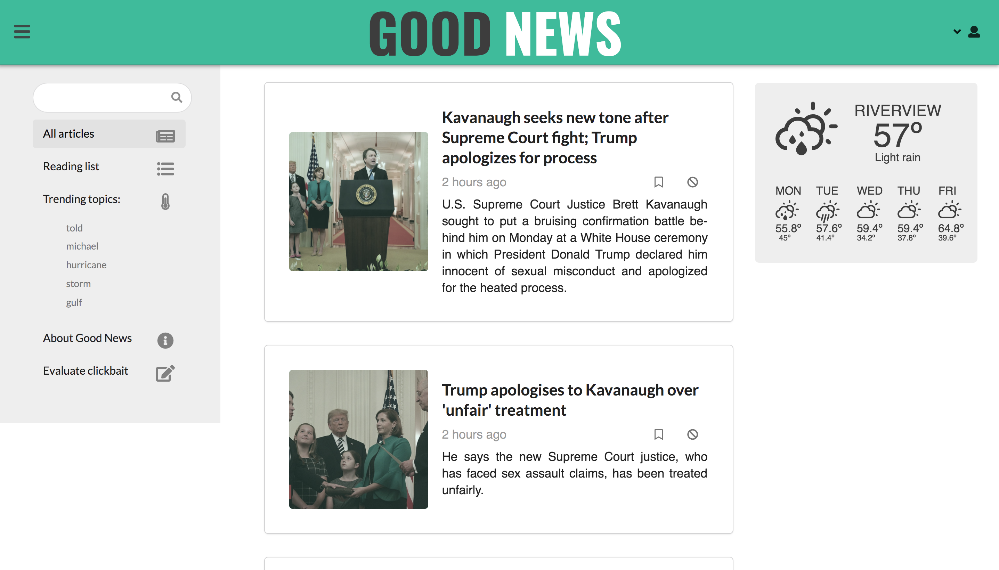
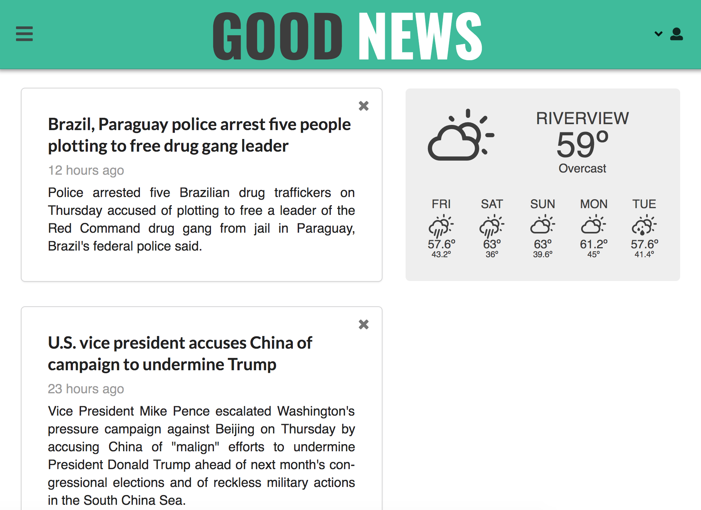
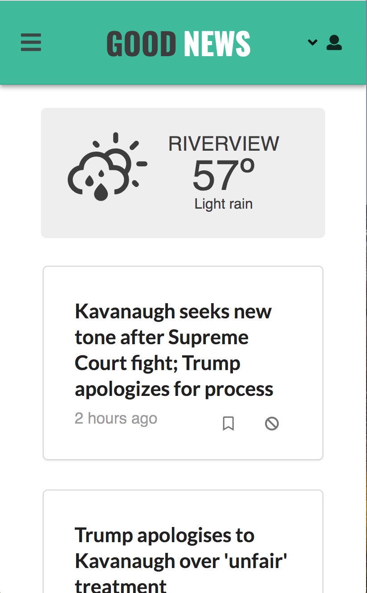

# Good News
[Good News](https://labs7goodnews.herokuapp.com/): A clickbait-free news aggregator

## Motivation
This project exists to bring news from a variety of sources to readers, while filtering out clickbait articles. Users can browse through a list of article titles (with a brief description) that link to the original source.

## Code style
TODO

[](https://github.com/feross/standard)
 
## Screenshots
### Soft Landing Page


### Sign In and Register


### All Articles


### Reading List


### News Sorted by Trending Topic


### Evaluate Clickbait View


### Modals for Reporting


### Other devices



## Tech Stack Used
<b>Built with</b>
- [React](https://reactjs.org/)
- [Node](https://nodejs.org/en/)
- [Express](http://expressjs.com/)
- [MongoDB](https://www.mongodb.com/)

Here is an [explanation](https://github.com/Lambda-School-Labs/CS10-GoodNews/blob/master/explanation.md) of why whe chose this stack and all of its back-end and front-end dependencies.

## Features
- Browse news articles, without the distraction of clickbait
- Add articles to your reading list for later reading
- See a list of trending topics from the last 24 hours
- Filter articles by topic
- Report clickbait when you see it
- Help us improve our model by evaluating articles that have been labeled as clickbait

## API Endpoints
### User
#### Register User
POST `/api/user/register/`\
Registers a new user in the database.\
Request body:

```
{
	"name": {
		"first": "First Name",
		"last": "Last Name"
	},
	"username": "username",
	"password": "password",
    "email": "user@email.com
}
```
`name`: Object
- `first`: String
- `last`: String

`username`: String\
`password`: String\
`email`: String\
Response:
```
{
    "token": "Bearer (token)",
    "user": {
        "_id": "_id",
        "username": "username"
    }
}
```
#### Login User
POST `/api/user/login/`\
Logs in an existing user\
Request body:

```
{
	"username": "username",
	"password": "password"
}
```

`username`: String\
`password`: String\
Response:
```
{
    "token": "Bearer (token)",
    "user": {
        "_id": "_id",
        "username": "username",
        "password": "password"
    }
}
```
#### Get All Users
GET `/api/user/`\
**Requires:** Authorization and userid\
Retrieves a list of users from the database\
Response:
```
[
    {
        "name": {
            "first": "First Name",
            "last": "Last Name"
        },
        "saved_articles": [],
        "updatedAt": "Date",
        "_id": "_id",
        "username": "username",
        "email": "user@email.com",
        "password": "password"
    }
]
```
#### Get User by _id
GET `/api/user/logged`\
**Requires:** Authorization and userid\
Retrieves an existing user by `_id`.\
Response:
```
{
    "name": {
        "first": "First Name",
        "last": "Last Name"
    },
    "saved_articles": [],
    "updatedAt": "Date",
    "_id": "_id_",
    "username": "username",
    "email": "user@email.com",
    "password": "password"
}
```
#### Update User
PUT `/api/user/logged`\
**Requires:** Authorization and userid\
Updates name, username, password and email for the user.\
Request body:
```
{
	"name": {
		"first": "New First Name",
		"last": "New Last Name"
	},
	"username": "new_username",
    "currentPassword": "currentPassword",
	"password": "password",
    "email": "new_user@email.com"
}
```
`name`: Object, optional\
`username`: String\
`currentPassword`: String, required. This should be the current password!\
`password`: String, optional\
`email`: String, optional\
Response:
```
{
    "name": {
        "first": "New First Name",
        "last": "New Last Name"
    },
    "saved_articles": [],
    "updatedAt": "Date",
    "_id": "_id_",
    "username": "new_username",
    "email": "new_user@email.com",
    "password": "new_password"
}
```
#### Delete User
DELETE `/api/user/logged`\
**Requires:** Authorization and userid\
Deletes a user from the database.\
Response includes a success message.

### Article
#### Add Article
POST `/api/article/post-article`\
**Requires:** Authorization and userid\
Request body:
```
{
    "id": "id",
    "name": "Article Name",
    "url": "https://www.cnn.com/article.html",
    "timestamp": "timestamp",
    "description": "description",
    "keywords": [ 
        "keyword"
    ],
    "summary": "summary",
    "content": "content",
    "clickbait": "0",
    "imageurl": "https://imageurl.com/image"
}
```
`id`: String\
`name`: String\
`url`: String\
`timestamp`: Date\
`description`: String\
`keywords`: [String]\
`summary`: String\
`content`: String\
`clickbait`: String\
`imageurl`: String

Response:
```
{
    "_id": "_id",
    "id": "id",
    "name": "Article Name",
    "url": "https://www.cnn.com/article.html",
    "timestamp": "timestamp",
    "description": "description",
    "keywords": [ 
        "keyword"
    ],
    "summary": "summary",
    "content": "content",
    "clickbait": "0",
    "createdAt": Date,
    "imageurl": "https://imageurl.com/image"
}
```
#### Get Articles by flag and activePage
GET `/api/article/get-articles/:flag/:activePage`\
Retrieves a list of articles based on flag and activePage.\
`flag` can be either "0" or "1"\
`activePage` is a string that represents a number in the 1-30 range.\
Response:
```
[
    {
        "_id": "_id",
        "id": "id",
        "name": "Article Name",
        "url": "https://www.cnn.com/article.html",
        "timestamp": "timestamp",
        "description": "description",
        "keywords": [ 
            "keyword"
        ],
        "summary": "summary",
        "content": "content",
        "clickbait": "0",
        "createdAt": Date,
        "imageurl": "https://imageurl.com/image"
    }
]
```
#### Get Article by id
GET `/api/article/get/:articleid`\
Retrieves an article based on `_id`.\
Response:
```
[
    {
        "_id": "_id",
        "id": "id",
        "name": "Article Name",
        "url": "https://www.cnn.com/article.html",
        "timestamp": "timestamp",
        "description": "description",
        "keywords": [ 
            "keyword"
        ],
        "summary": "summary",
        "content": "content",
        "clickbait": "0",
        "createdAt": Date,
        "imageurl": "https://imageurl.com/image"
    }
]
```
#### Get User saved_articles
GET `/api/article/user-saved`\
**Requires:** Authorization and userid\
Retrieves articles from User's saved_articles.\
Response:
```
[
    {
        "_id": "_id",
        "id": "id",
        "name": "Article Name",
        "url": "https://www.cnn.com/article.html",
        "timestamp": "timestamp",
        "description": "description",
        "keywords": [ 
            "keyword"
        ],
        "summary": "summary",
        "content": "content",
        "clickbait": "0",
        "createdAt": Date,
        "imageurl": "https://imageurl.com/image"
    }
]
```
#### Get Top Five Keywords
GET `/api/article/topfive`\
Retrieves top 5 keywords.\
Response:
```
[
    "keyword_1",
    "keyword_2",
    "keyword_3",
    "keyword_4",
    "keyword_5"
]
```
#### Get Articles by Keyword
GET `/api/article/:keyword`\
Retrieves non-clickbait articles containing the `keyword` passed in req.params.\
Response:
```
[
    {
        "_id": "_id",
        "id": "id",
        "name": "Article Name",
        "url": "https://www.cnn.com/article.html",
        "timestamp": "timestamp",
        "description": "description",
        "keywords": [ 
            "keyword"
        ],
        "summary": "summary",
        "content": "content",
        "clickbait": "0",
        "createdAt": Date,
        "imageurl": "https://imageurl.com/image"
    }
]
```
#### Update Article
PUT `/api/article/:articleid/:type`\
**Requires:** Authorization and userid\
Updates or Deletes articles by `articleid` and `type` in User's saved_articles property.\
`type` can be either "0" or "1"\
Response:
```
{
    "name": {
        "first": "First Name",
        "last": "Last Name"
    },
    "saved_articles": ["articleid"],
    "updatedAt": "Date",
    "_id": "_id_",
    "username": "username",
    "email": "user@email.com",
    "password": "hashed_password"
}
```
## Installation
`git clone git@github.com:Lambda-School-Labs/CS10-GoodNews.git`

## Data Science
This project was built in collaboration with Data Scientists. The repo for that side of this project is located [here](https://github.com/Lambda-School-Labs/DS-GoodNews)

## Tests
```
npm test
``` 

## Usage
First, visit [Good News](https://labs7goodnews.herokuapp.com/). Here you can browse the news. You can filter by topic, or search by keyword. 

If you'd like, you can create an account by clicking "Sign in" on the top right corner. With an account, you can save articles by adding them to your reading list and report clickbait if you encounter it. 

You can also help us improve our model by reviewing clickbait in the "Evaluate clickbait" view. All articles in the Evaluate section have been labeled as clickbait by our classifier. If you come across an article that has been wrongly labeled, you can send a report. We will use this data to retrain our model.

## Contribute
See our [Contribution Guideline](https://github.com/Lambda-School-Labs/CS10-GoodNews/blob/master/contributing.md) and [Code of Conduct](https://github.com/Lambda-School-Labs/CS10-GoodNews/blob/master/codeOfConduct.md)

## Credits
<b>Web Contributors</b>
[Cassandra Lamendola](https://github.com/CassLamendola)
[Sergey Nam](https://github.com/sharp0111)

<b>Data Science Contributors</b>
[Jason Fleischer](https://github.com/JasonRJFleischer)
[Leo Lam](https://github.com/leocpp)
[Maryna Longnickel](https://github.com/MarynaLongnickel)