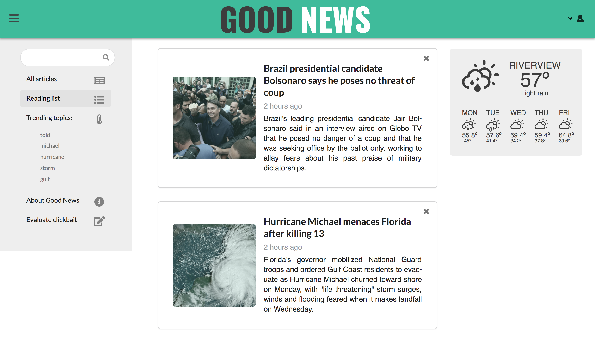

# CS10-GoodNews
A clickbait-free news aggregator

## Motivation
This project exists to bring news from a variety of sources to readers, while filtering out clickbait articles. Users can browse through a list of article titles (with a brief description) that link to the original source.

## Build status
TODO

## Code style
TODO

[](https://github.com/feross/standard)
 
## Screenshots
### Soft Landing Page


### Sign In and Register


### Reading List


### News Sorted by Trending Topic


### Evaluate Clickbait View


### Modals for Reporting


## Tech Used
<b>Built with</b>
- [React](https://reactjs.org/)
- [Node](https://nodejs.org/en/)
- [Express](http://expressjs.com/)
- [MongoDB](https://www.mongodb.com/)

## Why MERN?
Since this project had a short deadline with only two web engineers, we didn't want to optimize too early. At this stage, we were more concerned with getting an MVP quickly than scalability, with the plan to optimize later on. With this in mind, we chose the MERN stack.

<b>MongoDB</b>

MongoDB was selected because it is fast for prototyping, yet can easily be migrated to a SQL database in the future. During these early stages of development, it was useful to have the ability to quickly add fields to our application without having to worry about database migrations. 

<b>Node.js and Express.js</b>

Node has the advantage of a huge module ecosystem (npm). For most common problems, we can simply download a package instead of writing our own solution. Additionally, the modularity of the Node library lets us use only what we need, so it's more lightweight than a large framework.

The Express framework is also lightweight and flexible. Writing a RESTful API with Express is quick and easy.

<b>React.js</b>

React was selected for building the front end of the application in part for performance reasons. With React, we simply define the various views of the application, and are not concerned with manually managing changes in the DOM. Instead, React will update the "virtual DOM" automatically when state changes and the actual DOM will be updated more efficiently.

Since React has a large user base, it is well maintained with a large toolkit and thorough documentation.

We also chose React because components can be reused throughout the application, making it easy to maintain and grow.

Additionally, React has cross-platform support. We can reuse the architecture and logic in a React Native application for mobile devices in the future. 

## Features
- Browse news articles, without the distraction of clickbait
- Add articles to your reading list for later reading
- See a list of trending topics from the last 24 hours
- Filter articles by topic
- Report clickbait when you see it
- Help us improve our model by evaluating articles that have been labeled as clickbait

## API Endpoints
### User
1. `/api/user/` \
GET to get all users - protected route
2. `/api/user/register/`\
POST to register a new user. Returns userObj={token, user}
3. `/api/user/login/` \
POST to login existing user
4. `/api/user/login/logged` \
GET to get an existing user - protected route. \
PUT to update an existing user - protected route. Returns the updated user. \
DELETE to delete an existing user - protected route. Returns the deleted user.

### Article
1. `/api/article/` \
GET to get all articles. \
POST to load an article into DB - protected route. Returns the saved article.
2. `/api/article/:articleid/` \
GET to get an existing article by MongoDB-generated _id
3. `/api/article/:articleid/:type/` \
where type = 'add' || 'del' \
PUT to add || del an existing article _id to an existing user. Returns the user.

## Installation
`git clone git@github.com:Lambda-School-Labs/CS10-GoodNews.git`

## Data Science
This project was built in collaboration with Data Scientists. The repo for that side of this project is located [here](https://github.com/Lambda-School-Labs/DS-GoodNews)

## Tests
### Back end tests:
in root directory
```
npm test
```

### Front end tests:
in client directory
```
npm test
``` 

## How to use?
TODO
If people like your project they’ll want to learn how they can use it. To do so include step by step guide to use your project.

## Contribute
TODO
Let people know how they can contribute into your project. A [contributing guideline](https://github.com/zulip/zulip-electron/blob/master/CONTRIBUTING.md) will be a big plus.

## Credits
TODO
Give proper credits. This could be a link to any repo which inspired you to build this project, any blogposts or links to people who contrbuted in this project.

## License
TODO
A short snippet describing the license (MIT, Apache etc)
